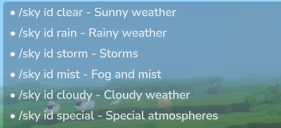
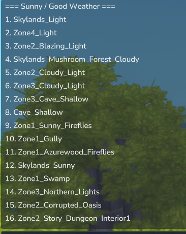

# BrocMod


A simple plugin for Hytale servers that adds useful commands and automatic features for players.

## ✨ What is it?

BrocMod is a plugin for Hytale servers that allows you to add new commands in-game and improve the player experience. Easy to install and use!

## 🎉 Automatic Features

### Welcome Message
When a player joins the server, a **custom title** appears on the screen with their username!

**Preview :**


*A large title "Welcome!!!" appears on screen with the player's name*

## 📋 Available Commands

| Command | Description |
|---------|-------------|
| `/hello` | Display a welcome message on screen |
| `/status` | Display your player statistics (health, stamina, world) |
| `/clock` | Display the current time in the world |
| `/clock set HH:MM` | Change the time to a precise value (ex: 14:30) |
| `/clock midday` | Change the time to noon (12:00) |
| `/clock midnight` | Change the time to midnight (00:00) |
| `/sky clear` | Clear the sky for bright sunshine |
| `/sky rain` | Trigger rain |
| `/sky storm` | Trigger a violent storm |
| `/sky set <id>` | Apply a specific weather by ID |
| `/sky current` | Display the current weather ID |
| `/sky id` | List weather categories |
| `/sky id <category>` | List weather IDs in a category |
| `/fly` | Toggle fly on/off |
| `/fly turbo` | Toggle fly turbo (3x speed) |
| `/clearchat` | Clear chat (push blank lines) |
| `/god` | Toggle godmode (cancel incoming damage) |

### 💬 `/hello`
Displays a stylish welcome message directly on your screen. Perfect for testing the plugin!

**Preview :**


*A large "Welcome adventurer!" title appears in gold on screen*

### 📊 `/status`
Shows your current information :
- 👤 Your username
- 🌍 The world you are in
- ❤️ Your health points
- ⚡ Your stamina level

**Preview :**


*Complete display of your statistics in-game*

### ⏰ `/clock`
Time management in the world :
- **`/clock`** → Display current time (format : 14h05)
- **`/clock set HH:MM`** → Change time to a precise value (ex: `/clock set 14:30`)
- **`/clock midday`** → Instantly change time to noon
- **`/clock midnight`** → Instantly change time to midnight

**Preview :**


*Display the world's current time in HHhMM format*

### 🌦️ `/sky`
Weather management :
- **`/sky clear`** → Bright sunshine
- **`/sky rain`** → Rainy weather
- **`/sky storm`** → Violent thunderstorm
- **`/sky set <weather_id>`** → Apply any weather by its ID
- **`/sky current`** → Display the current weather ID
- **`/sky id`** → List all available weather categories
- **`/sky id <category>`** → List all weather IDs in a category (clear, rain, storm, mist, cloudy, special)

**Preview - Sky ID Categories :**



*List of all available weather categories with their descriptions*

**Preview - Sky ID Sunny Weather :**



*Example: List of all sunny weather IDs in the "clear" category*

### 🕊️ `/fly`
Toggle player flying.
- **`/fly`** → Enable/disable flying
- **`/fly turbo`** → Toggle a faster fly speed (3x)

### 🛡️ `/god`
Toggle godmode (invulnerability).

When enabled, incoming [`Damage`](hytale-source/com/hypixel/hytale/server/core/modules/entity/damage/Damage.java:28) events are cancelled for the player.

### 🧹 `/clearchat`
Clears chat by sending blank lines.

## 🚀 Installation

### What you need
- A Hytale server that supports plugins
- Java 17 or newer

### Install the plugin

**Option 1: Quick installation**
1. Download the `app.jar` file
2. Place it in your server's `mods/` folder
3. Restart the server

**Option 2: Compile it yourself**
```bash
./compile-copy.sh
```
The plugin will be automatically compiled and copied to the right place.

## 📖 How to use

Once the server is started with the plugin installed, simply type the commands in-game :

```
/hello
/status
/clock
/clock set 14:30
/clock midday
/clock midnight
/sky clear
/sky rain
/sky storm
/sky set Skylands_Sunny
/sky current
/sky id
/sky id clear
/fly
/fly turbo
/clearchat
/god
```

That's it! No special permissions required.

## 🛠️ For Developers

Want to modify or improve the plugin? Here are the important files:

```
app/src/main/java/com/hytable/plugin/
├── BrocMod.java              # Main file that loads commands and events
├── commands/                  # Folder containing all commands
│   ├── HelloCommand.java      # Code for /hello command
│   ├── StatusCommand.java     # Code for /status command
│   ├── ClockCommand.java      # Code for /clock command with subcommands (set, midday, midnight)
│   ├── FlyCommand.java        # Code for /fly command (and /fly turbo)
│   ├── ClearChatCommand.java  # Code for /clearchat command
│   ├── GodCommand.java        # Code for /god command (toggle)
│   └── SkyCommand.java        # Code for /sky command with subcommands (clear, rain, storm, set, current, id)
└── handlers/                  # Automatic event handlers
    ├── WelcomeHandler.java    # Handles welcome message on connection
    └── GodDamageHandler.java  # Cancels damage when /god is enabled
```

### Build the project

```bash
# Build the project
./gradlew build

# Clean and rebuild
./gradlew clean build

# Run tests
./gradlew test
```

## 🤝 Contribution

Feel free to :
- ✨ Propose new commands
- 🐛 Report bugs
- 📝 Improve documentation
- 🚀 Add features

## 👤 Author

Developed by Alex

---

**Note** : Plugin in active development 🚧
