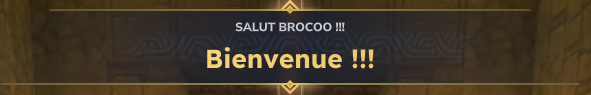
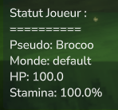

# BrocPlug


Un plugin simple pour serveur Hytale qui ajoute des commandes utiles et des fonctionnalités automatiques pour les joueurs.

## ✨ Qu'est-ce que c'est ?

BrocPlug est un plugin pour serveurs Hytale permettant d'ajouter de nouvelles commandes dans le jeu et d'améliorer l'expérience des joueurs. Facile à installer et à utiliser !

## 🎉 Fonctionnalités automatiques

### Message de bienvenue
Lorsqu'un joueur rejoint le serveur, un **titre personnalisé** s'affiche à l'écran avec son pseudo !

**Aperçu :**



*Un grand titre "Bienvenue !!!" s'affiche à l'écran avec le nom du joueur*

## 📋 Commandes disponibles

| Commande | Description |
|----------|-------------|
| `/hello` | Affiche un message de bienvenue à l'écran |
| `/status` | Affiche vos statistiques de joueur (vie, stamina, monde) |
| `/clock` | Affiche l'heure actuelle du monde |
| `/clock set HH:MM` | Change l'heure à une valeur précise (ex: 14:30) |
| `/clock midday` | Change l'heure à midi (12h00) |
| `/clock midnight` | Change l'heure à minuit (00h00) |
| `/sky clear` | Dégage le ciel pour un grand soleil |
| `/sky rain` | Déclenche la pluie |
| `/sky storm` | Déclenche un violent orage |

### 💬 `/hello`
Affiche un message de bienvenue stylé directement sur votre écran. Parfait pour tester le plugin !

**Aperçu :**


*Un grand titre "Bienvenue !!!" s'affiche en or à l'écran*

### 📊 `/status`
Montre vos informations actuelles :
- 👤 Votre pseudo
- 🌍 Le monde dans lequel vous êtes
- ❤️ Vos points de vie
- ⚡ Votre niveau de stamina

**Aperçu :**



*Affichage complet de vos statistiques en jeu*

### ⏰ `/clock`
Gestion du temps dans le monde :
- **`/clock`** → Affiche l'heure actuelle (format : 14h05)
- **`/clock set HH:MM`** → Change l'heure à une valeur précise (ex: `/clock set 14:30`)
- **`/clock midday`** → Change instantanément l'heure à midi
- **`/clock midnight`** → Change instantanément l'heure à minuit

**Aperçu :**


*Affiche l'heure actuelle du monde au format HHhMM*

### 🌦️ `/sky`
Gestion de la météo :
- **`/sky clear`** → Met un grand soleil
- **`/sky rain`** → Fait tomber la pluie
- **`/sky storm`** → Déclenche l'orage

**Aperçu :**


*Change instantanément la météo du monde*

## 🚀 Installation

### Ce dont vous avez besoin
- Un serveur Hytale qui supporte les plugins
- Java 17 ou plus récent

### Installer le plugin

**Option 1 : Installation rapide**
1. Téléchargez le fichier `app.jar`
2. Placez-le dans le dossier `mods/` de votre serveur
3. Redémarrez le serveur

**Option 2 : Compiler vous-même**
```bash
./compile-copy.sh
```
Le plugin sera automatiquement compilé et copié au bon endroit.

## 📖 Comment utiliser

Une fois le serveur démarré avec le plugin installé, tapez simplement les commandes en jeu :

```
/hello
/status
/clock
/clock set 14:30
/clock midday
/clock midnight
/sky clear
/sky rain
/sky storm
```

C'est tout ! Aucune permission spéciale requise.

## 🛠️ Pour les développeurs

Vous voulez modifier ou améliorer le plugin ? Voici les fichiers importants :

```
app/src/main/java/com/hytable/plugin/
├── BrocPlug.java              # Fichier principal qui charge les commandes et événements
├── commands/                  # Dossier contenant toutes les commandes
│   ├── HelloCommand.java      # Code de la commande /hello
│   ├── StatusCommand.java     # Code de la commande /status
│   ├── ClockCommand.java      # Code de la commande /clock avec sous-commandes (set, midday, midnight)
│   └── SkyCommand.java        # Code de la commande /sky avec sous-commandes (clear, rain, storm)
└── handlers/                  # Gestionnaires d'événements automatiques
    └── WelcomeHandler.java    # Gère le message de bienvenue à la connexion
```

### Compiler le projet

```bash
# Compiler
./gradlew build

# Nettoyer et recompiler
./gradlew clean build

# Lancer les tests
./gradlew test
```

## 🤝 Contribution

N'hésitez pas à :
- ✨ Proposer de nouvelles commandes
- 🐛 Signaler des bugs
- 📝 Améliorer la documentation
- 🚀 Ajouter des fonctionnalités

## 👤 Auteur

Développé par Alex

---

**Note** : Plugin en développement actif 🚧
